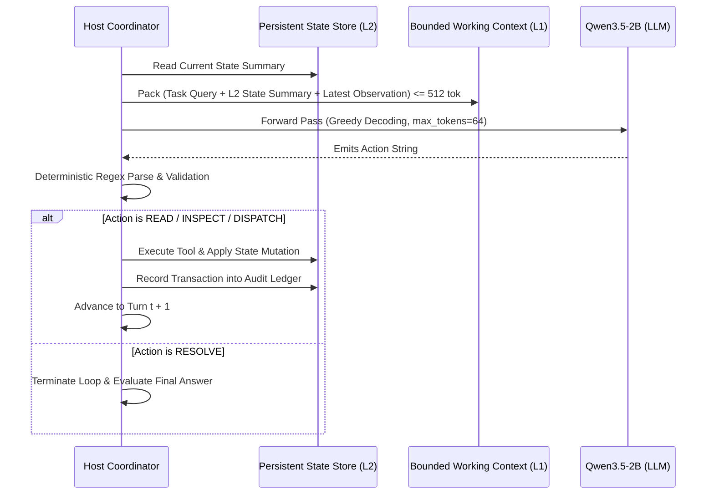

# MN-012 Gate B: Measurement Contract & Evaluation Protocol

## Context & Navigation
- Canonical Knowledge Base: [00-mong-nhiem](../../../00-mong-nhiem.md)
- System Architecture: [architecture](../../../concepts/architecture.md)
- Conceptual Taxonomy: [ECC vs NCC](../../../concepts/ecc-vs-ncc.md)
- Strategic Roadmap: [roadmap](../../../roadmap.md)
- Parent Milestone Charter: [MN-012 Gate A Charter](charter.md)
- Corpus Definition: `definition/corpus-v1/cases.jsonl` (to be materialized)
- Execution Script: `scripts/mn012_executor.py` (to be materialized)

---

## 1. Objectives & Measurement Principles

This contract establishes the empirical measurement protocol for **MN-012: Hierarchical Tool & Memory Integration**.
The primary objective is to verify whether lightweight language models (<4B) can reliably execute structured multi-turn tool calling and maintain persistent state continuity across $T \le 5$ turns when supported by host-managed hierarchical memory partitioning.

All measurements must adhere to five strict scientific principles:
1. **Black-Box Invariant:** Models are evaluated strictly as frozen black-box decoders (`temperature=0.0`, greedy single-pass). Zero weights, adapters, or embeddings are modified.
2. **Hard Token Accounting:** Every per-turn prompt is tokenized and verified against the canonical tokenizer (`llama-tokenize.exe` with `Qwen3.5-2B-Q4_K_M.gguf`).
3. **Hermetic Sandbox Isolation:** All prototype code, tool runners, and intermediate state databases remain strictly within `research/experiments/prototypes/mn-012-hierarchical-tool-memory/`.
4. **Decoupled Disk Persistence:** Every model generation, tool invocation, and state ledger mutation is persisted to disk before scoring (`persist-before-evaluate` contract).
5. **Failure-Isolation Gating:** Operational failures are categorized strictly into:
   - Layer 1 (Grammar/Syntax Collapse)
   - Layer 2 (Tool Semantics/Argument Hallucination)
   - Layer 3 (State Desynchronization)
   - Layer 4 (Reasoning/Goal Synthesis)

---

## 2. Tool Grammar & Host Coordination Protocol

### Deterministic Regex Action Grammar
To ensure absolute resilience against JSON syntax degradation on small models, MN-012 extends the verified MN-010 grammar into a structured tool-action protocol:

```text
ACTION: READ <target_id>
ACTION: INSPECT <entity_id>.<property>
ACTION: DISPATCH <action_name> <payload>
ACTION: RESOLVE <final_result>
```

### Turn Execution Cycle ($t = 1 \dots 5$)


---

## 3. Benchmark Corpus Design (60 Stateful Cases, $T \le 5$ turns)

To ensure the most rigorous evaluation barrier before any potential promotion into production packages, the evaluation suite comprises 60 deterministic multi-turn tool interaction cases across 3 distinct operational domains (20 cases per domain):

| Domain | Case Count | Turn Horizon | Core Capability Under Evaluation |
| :--- | :---: | :---: | :--- |
| **Domain A: Codebase Refactoring & AST Mutation (`code_mutation`)** | 20 | $3 - 5$ turns | Model reads a target function, inspects downstream call references, dispatches a signature mutation, verifies syntax validity, and resolves the updated interface hash. Includes invalid syntax injection and circular call edge cases. |
| **Domain B: Stateful Resource Ledger & Inventory (`resource_ledger`)** | 20 | $3 - 5$ turns | Multi-entity resource allocation. Model inspects entity balances, dispatches transactional transfers across accounts, verifies balance conservation invariants, and resolves final state. Includes overdraft boundary checks and multi-party transfer loops. |
| **Domain C: System Registry & Configuration (`system_registry`)** | 20 | $3 - 5$ turns | Model inspects hierarchical config blocks, queries service dependency status, dispatches environment flag mutations, and resolves target deployment readiness. Includes conflicting flag stress tests and deeply nested keys. |

---

## 4. Dual-Track Execution Protocol

All 60 cases must be verified across both execution tracks:
- **Track 1 (Deterministic Simulator):** Validates deterministic logic, invariant enforcement, state machine transitions, and edge cases under automated test suites.
- **Track 2 (Real Model Inference):** Evaluates `Qwen3.5-2B-Q4_K_M.gguf` directly via `llama-cli.exe` (greedy decoding `temp=0.0`, `max_tokens=64`, `--no-warmup`) to produce immutable Gate C empirical evidence.

---

## 5. Five Frozen Acceptance Rules

To qualify for recommendation at Gate D disposition review, the prototype execution must satisfy all 5 frozen acceptance rules:

### Rule 1: Multi-Turn Task Completion Efficacy
- **Requirement:** `Qwen3.5-2B` must achieve $\ge 85\%$ end-to-end task success ($\ge 51/60$ cases resolved correctly).
- **Control Baseline:** Direct single-pass baseline without tools must achieve $< 20\%$ on the same stateful problems.

### Rule 2: Hard Per-Turn Token Budget Ceiling
- **Requirement:** Exactly $100\%$ of generated turn prompts must strictly adhere to:
  $$\text{TokenCount}(\text{turn\_prompt}) \le 512$$
- **Tolerance:** Exactly 0 overflow occurrences across all turns and cases under `llama-tokenize.exe`.

### Rule 3: Tool Action Protocol Conformance
- **Requirement:** Exactly $100\%$ of emitted model outputs must match the defined regex grammar without syntax invalidity, markdown code fences, or conversational preamble drift.

### Rule 4: State Invariant Preservation across L2 Store
- **Requirement:** Exactly $100\%$ of successful executions must preserve environment invariants (zero conservation breaches in resource balances, zero invalid syntax in AST mutations).

### Rule 5: Host Coordination Overhead & Latency
- **Requirement:** Host CPU coordination overhead (parsing + tool execution + L1 packing) must average $< 10\text{ ms}$ per turn. Total end-to-end execution latency must remain $< 2.5\text{s}$ per 5-turn case.

---

## 6. Directional Pivoting Gate & Failure Taxonomy

If the prototype fails to satisfy the Gate B criteria, the failure mode dictates the mandatory architectural pivot:

1. **Failure Mode 1: Format Collapse ($> 10\%$ parsing errors under Rule 3):**
   - *Diagnosis:* Regex prompting is insufficient for multi-argument tool signatures on lightweight models.
   - *Mandatory Pivot:* Implement GBNF grammar-constrained decoding (`root ::= "ACTION: " ...`) to enforce 100% token-level syntax validity before retrying.
2. **Failure Mode 2: Argument Hallucination ($> 10\%$ invalid entity references under Rule 4):**
   - *Diagnosis:* The L1 working set does not provide sufficient entity anchoring.
   - *Mandatory Pivot:* Restructure the L1 state summary format (e.g. strict typed entity slot tables) rather than increasing context length.
3. **Failure Mode 3: Goal Divergence ($> 15\%$ failure under Rule 1 despite valid tool syntax):**
   - *Diagnosis:* The model cannot synthesize multi-step causality without error recovery.
   - *Mandatory Pivot:* Advance immediately to MN-013 to introduce host-guided backtracking and action rejection feedback.
