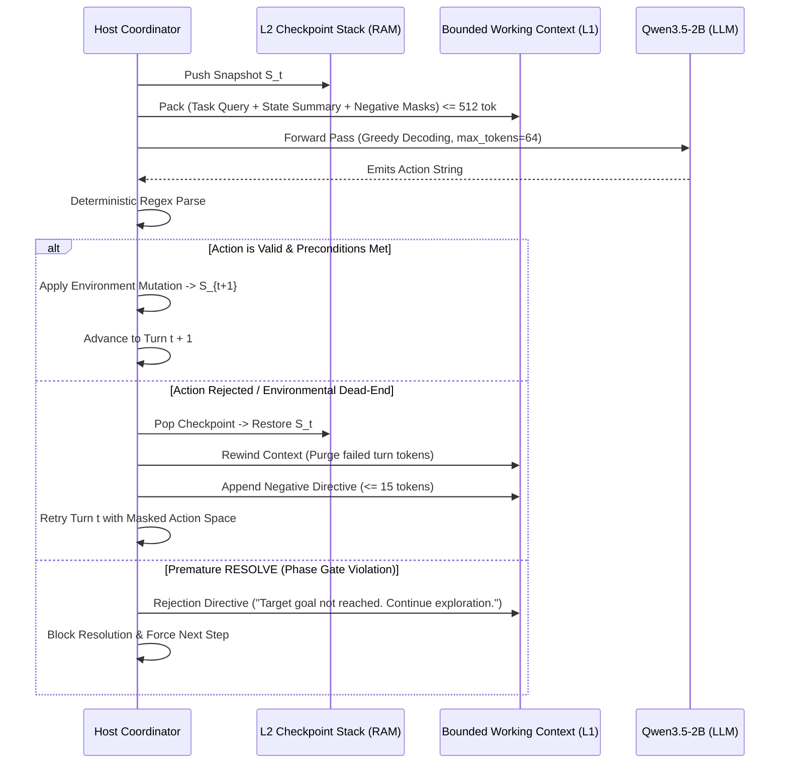

# MN-013 Gate B: Measurement Contract & Evaluation Protocol

## Context & Navigation
- Canonical Knowledge Base: [00-mong-nhiem](../../../00-mong-nhiem.md)
- System Architecture: [architecture](../../../concepts/architecture.md)
- Conceptual Taxonomy: [ECC vs NCC](../../../concepts/ecc-vs-ncc.md)
- Strategic Roadmap: [roadmap](../../../roadmap.md)
- Parent Milestone Charter: [MN-013 Gate A Charter](charter.md)
- Corpus Definition: `definition/corpus-v1/cases.jsonl` (to be materialized)
- Execution Script: `scripts/mn013_executor.py` (to be materialized)

---

## 1. Objectives & Measurement Principles

This contract establishes the empirical measurement protocol for **MN-013: Backtracking & Error Self-Correction**.
The primary objective is to evaluate whether host-directed state rollback, context rewind, and negative action masking enable lightweight language models (<4B) to escape environmental dead-ends and successfully complete multi-turn tasks ($T \le 7$ turns, $K \le 3$ rollbacks) while preserving the $\le 512$ token budget ceiling.

All measurements must adhere to five frozen scientific principles:
1. **Black-Box Invariant:** `Qwen3.5-2B-Q4_K_M` is evaluated strictly as a frozen decoder (`temperature=0.0`, greedy single-pass). Zero parameter updates or custom logit biases.
2. **Hard Token Accounting:** Every per-turn prompt is tokenized and verified against the canonical tokenizer (`llama-tokenize.exe` with `Qwen3.5-2B-Q4_K_M.gguf`).
3. **Hermetic Sandbox Isolation:** All prototype code, checkpoint data structures, and intermediate runs remain strictly within `research/experiments/prototypes/mn-013-backtracking-error-correction/`.
4. **Decoupled Disk Persistence:** Every model generation, tool invocation, rollback event, and environment state snapshot is persisted to disk before scoring (`persist-before-evaluate` contract).
5. **Deterministic Deadlock Accounting:** Action repetition is tracked explicitly; repeated emission of a rejected action is counted as an immediate deadlock violation.

---

## 2. Host-Directed Backtracking Protocol

### Action Grammar
MN-013 preserves the proven regex action grammar established in MN-012:

```text
ACTION: READ <target_id>
ACTION: INSPECT <entity_id>.<property>
ACTION: DISPATCH <action_name> <payload>
ACTION: RESOLVE <final_result>
```

### Execution & Rollback Cycle


---

## 3. Benchmark Corpus Design (60 Cases with Deadlock Traps)

The benchmark comprises 60 multi-turn test cases across 3 operational domains, inheriting the domain topologies of MN-012 while embedding deterministic dead-end trap states:

| Domain | Case Count | Turn Horizon | Dead-End Injection Topology |
| :--- | :---: | :---: | :--- |
| **Domain A: Code AST Refactoring & Syntax Recovery (`code_mutation`)** | 20 | $3 - 7$ turns | Model dispatches an AST rewrite that fails static type checking or induces circular dependencies; host rejects action, restores clean AST snapshot, and masks the faulty signature. |
| **Domain B: Transactional Resource Contention (`resource_ledger`)** | 20 | $3 - 7$ turns | Allocation route encounters overdraft or locked sub-ledger; host rolls back state to prior checkpoint and injects negative constraint to force alternate transfer route. |
| **Domain C: Registry Dependency Conflict (`system_registry`)** | 20 | $3 - 7$ turns | Flag mutation triggers mutual exclusion conflict; host rolls back configuration snapshot and directs exploration along orthogonal branch. |

---

## 4. Four-Arm Comparative Protocol

To isolate the causal contribution of each architectural component, MN-013 evaluates 4 experimental arms:

1. **Arm 1: Forward-Only Baseline (MN-012 replicate):** No checkpointing, no rollback. Action failure causes immediate abort or amnesiac continuation.
2. **Arm 2: Naive History Accumulation:** Standard multi-turn paradigm where rejected actions and error messages are appended chronologically to the prompt without context rewinding.
3. **Arm 3: Context Rewind Only:** State is rolled back and prompt context is rewound to prior turn, but no negative action mask is provided (evaluates whether small models repeat mistakes without explicit negative instruction).
4. **Arm 4: Full MN-013 (Context Rewind + Negative Masking + Phase Gating):** State rollback, purged turn tokens, 15-token negative action constraint, and predicate-checked resolution.

---

## 5. Five Frozen Acceptance Rules

To qualify for recommendation at Gate D disposition review, Arm 4 must satisfy all 5 frozen acceptance rules:

### Rule 1: Deadlock Recovery Efficacy
- **Requirement:** `Qwen3.5-2B` under Arm 4 must achieve $\ge 80\%$ task completion ($\ge 48/60$ cases resolved correctly).
- **Comparison:** Arm 1 (Forward-only) must remain $< 25\%$ on trap cases.

### Rule 2: Hard Per-Turn Token Budget Ceiling
- **Requirement:** Exactly $100\%$ of generated turn prompts must adhere to:
  $$\text{TokenCount}(\text{turn\_prompt}) \le 512$$
- **Tolerance:** 0 overflow occurrences across all turns and rollbacks under `llama-tokenize.exe`. (Arm 2 expected to fail this rule).

### Rule 3: Deterministic Loop Suppression
- **Requirement:** Repeated emission of an identical rejected action within the same case must be exactly $0\%$ ($0$ deadlock loops).

### Rule 4: State Invariant Restoration Accuracy
- **Requirement:** $100\%$ of rollback operations must restore environment state bit-for-bit to the pre-action snapshot (zero state drift or zombie mutations in L2).

### Rule 5: Host Rollback Overhead & Latency
- **Requirement:** Host CPU snapshot and rollback operations (`deepcopy` + stack management) must average $< 5\text{ ms}$ per rollback. Total case latency must remain $< 3.5\text{s}$.

---

## 6. Directional Pivoting Gate & Failure Taxonomy

If Arm 4 fails to meet the Gate B criteria, the failure mode dictates the subsequent research trajectory:

1. **Failure Mode 1: Negative Mask Non-Compliance ($> 10\%$ repetition under Rule 3):**
   - *Diagnosis:* Small models ignore natural language negative directives (`"Do NOT repeat X"`).
   - *Mandatory Pivot:* Introduce logit suppression (token-level masking) or GBNF grammar dynamic constraint to physically forbid generation of the rejected action string.
2. **Failure Mode 2: Budget Inflation ($> 0\%$ overflows under Rule 2):**
   - *Diagnosis:* Stacking negative masks across multiple rollbacks breaches the 512-token ceiling.
   - *Mandatory Pivot:* Restrict negative mask history to the immediate previous failed action ($\text{mask\_depth} = 1$) or compress masks into entity slot disallow-lists.
3. **Failure Mode 3: Combinatorial Horizon Exhaustion ($> 20\%$ timeout/step limit exceeded):**
   - *Diagnosis:* Small models lack direction heuristic when multiple alternate branches exist.
   - *Mandatory Pivot:* Introduce host-directed affordance pruning (listing only valid candidate actions in prompt).
